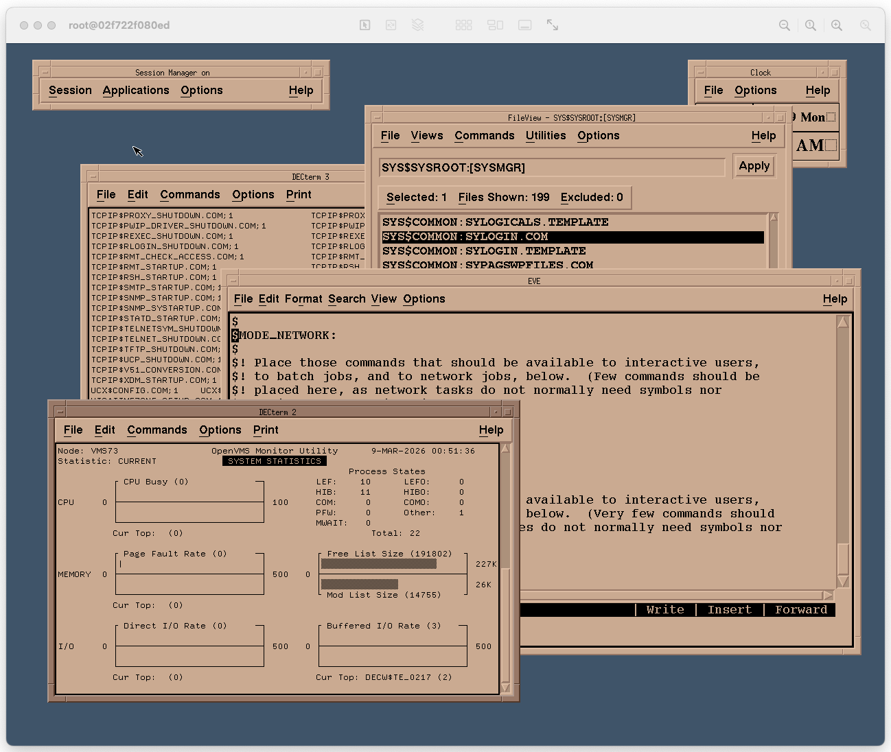

# OpenVMS 7.3 on SIMH VAX - Docker Container with DEC Windows via VNC

https://hub.docker.com/r/tenox7/openvms73



## Running

```sh
docker run -it --rm tenox7/openvms73:latest
```

Login as `system` password is `system`.


## Telnet 

To telnet/ftp/rlogin/rsh to the guest add `-p`, for example for telnet:

```sh
docker run -it --rm -p 23:23 tenox7/openvms73:latest
```

## RSH / RLOGIN

rsh and rlogin are fully functional thanks to a built-in relay:

```sh
rsh system@127.0.0.1 dir
```

You can use [RSH-MCP](https://github.com/tenox7/rsh-mcp) with your favorite agent.

## VNC to DEC Windows

A VNC Server is built-in the container. The password is `vncvms`.  On MacOS you can simply `open vnc://127.0.0.1`. If using RealVNC you might need to set `ColorLevel` to `full`.

```sh
docker run -it --rm -p 5900:5900 tenox7/openvms73:latest
```

To change resolution: `-e GEOMETRY=1920x1200`

## X11

To forward X11 XDMCP Query port add `-p 177:177/udp`:

```sh
docker run -it --rm -p 23:23 -p 177:177/udp tenox7/openvms73:latest
```

*I was not able to connect to it unless the client display is `:0`. In particular `Xnest -ac -query :1` did not work for me. Only `:0` does. If you know how to fix it, LMK.*


## Persistent State

By default the guest is ephemeral, the state is NOT preserved once you exit from the container. Which is desired for experimentation and messing up the system for fun.

In order to persist the data disk mount `/data` as a volume or bind mount. Simply add:


```sh
docker run -it --rm -v <volume|path>:/data tenox7/openvms73:latest
```

The disk image and nvram is stored in `/data` in the container. 

## Quiting

Ctrl^E in the terminal will shut down SIMH.

## Applications Preinstalled

- DEC Write
- DEC [ALL-IN-1](https://en.wikipedia.org/wiki/ALL-IN-1)
- Mosaic Browser
- Netscape Navigator
- Word Perfect
- DEC Write
- DEC Flight Simulator
- SoftPC
- NEdit
- Etc

### How to run ALL-IN-1 ?

From console/etc login as office / office. In DECterm as another user `set host 0`.

## Publishing Disk Image

`vax.dsk.xz` is not stored in git. It's published as a GitHub release asset (`disk-vN` tags), the Dockerfile pulls the latest release.

```sh
./run-data.sh           # run with ./data mounted, modify VMS, shut down with Ctrl^E
make data               # compress data/vax.dsk into vax.dsk.xz
make data-release V=15  # upload as release disk-v15 and mark latest (V = next number)
make build              # rebuild image with the new disk
```
